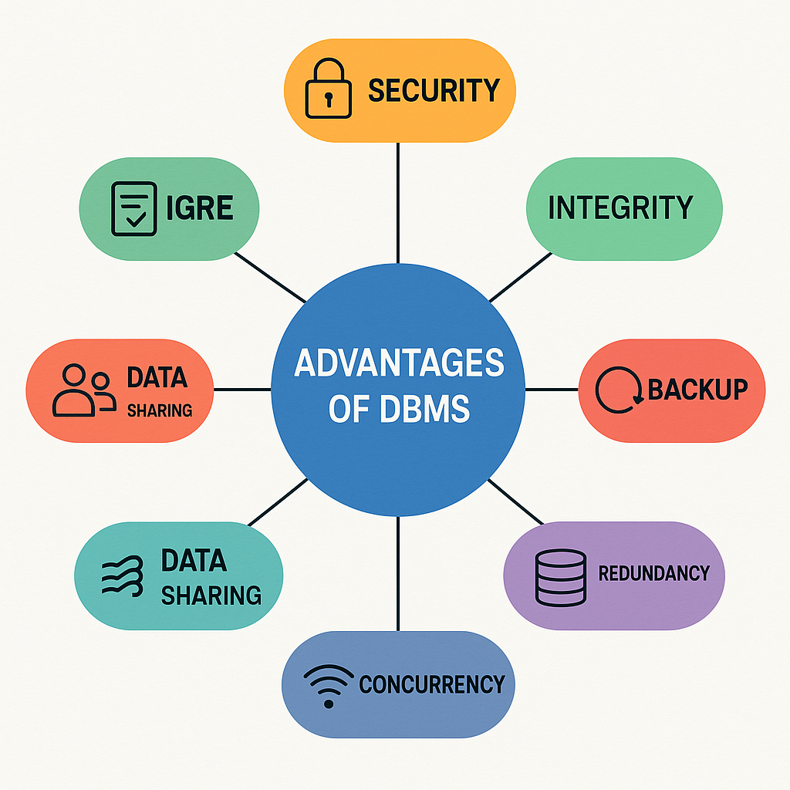

# 📘 Database Course Documentation

This repository includes a complete documentation report covering:

- ✅ Comparison between Flat File Systems & Relational Databases
- ✅ DBMS Advantages Mind Map
- ✅ Key Roles in a Database System
- ✅ Types of Databases (Relational, Non-Relational, Centralized, Cloud)
- ✅ Cloud Storage & Databases overview

## 📄 Report PDF
You can view or download the full report here: [Database_Report.pdf](./Database_Report.pdf)

## 🧠 Mind Map Preview

